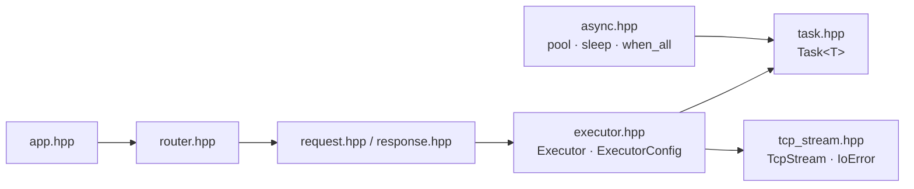

# API Reference

Aevox's public API lives entirely under `include/aevox/`. No internal headers (`src/`) are part of the public surface.

---

## Available Today

| Module | Header | Description |
|---|---|---|
| [Executor](executor.md) | `<aevox/executor.hpp>` | Async I/O execution layer — thread pool, TCP accept loops, graceful drain |
| [Task](task.md) | `<aevox/task.hpp>` | Coroutine return type for all async operations |
| [Async Helpers](async.md) | `<aevox/async.hpp>` | `pool()`, `sleep()`, `when_all()` — CPU offload, timers, concurrent fan-out |
| [TcpStream](tcp_stream.md) | `<aevox/tcp_stream.hpp>` | Move-only async TCP connection — `read()` and `write()` as coroutines |
| [Request and Response](request-response.md) | `<aevox/request.hpp>` / `<aevox/response.hpp>` | Incoming HTTP request and outgoing HTTP response — typed parameter extraction, factory methods, fluent header builder |
| [Router and App](router.md) | `<aevox/router.hpp>` / `<aevox/app.hpp>` | URL routing and top-level server entry point — static, parameter, wildcard segments |

---

## Coming in v0.2

| Module | Header | Description |
|---|---|---|
| Middleware | `<aevox/middleware.hpp>` | Composable middleware pipeline |

---

## Dependency Map



`executor.hpp` includes `task.hpp` and `tcp_stream.hpp` transitively — a single `#include <aevox/executor.hpp>` is sufficient for most connection-handler code.

---

## C++23 Requirement

All Aevox headers require **C++23 or later**:

```cmake
target_compile_features(your_target PRIVATE cxx_std_23)
```

Supported compilers:

| Platform | Compiler | Minimum version |
|---|---|---|
| Linux | GCC | 13 |
| Windows | MSVC | 2022 / 17.8 |

---

## Error Handling Convention

All fallible operations return `std::expected<T, ErrorEnum>` and are marked `[[nodiscard]]`. The compiler warns if you discard the result without checking it.

```cpp
// Always check expected returns
auto result = executor->listen(8080, handler);
if (!result) {
    std::println(stderr, "listen failed: {}", aevox::to_string(result.error()));
    return 1;
}

// read() and write() are also expected — check them in your handler
auto data = co_await stream.read();
if (!data) co_return;   // handle IoError
```

No Aevox function throws for a recoverable error. Exceptions only propagate from coroutine internals (e.g. `std::bad_alloc`) or from user-supplied lambdas passed to `aevox::pool()`.

---

## See Also

- [User Guide](../guide/index.md) — practical, example-driven guide for every framework feature
- [Architecture Overview](../architecture/index.md) — design rationale and diagrams for each component
