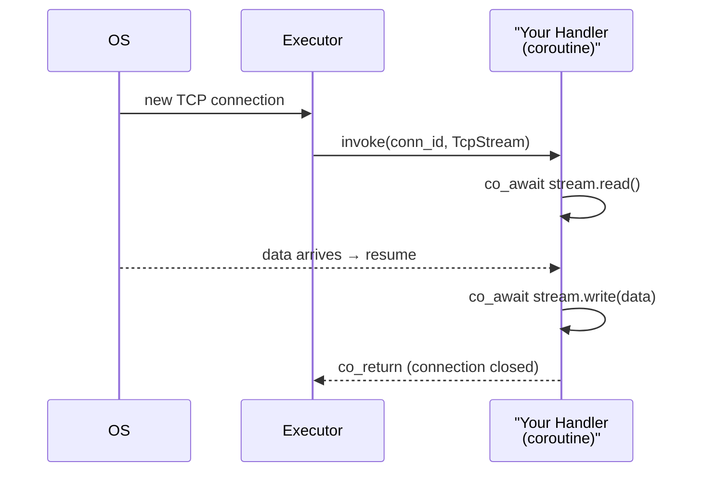

# TcpStream

> An owned, move-only async TCP connection. Passed to every connection handler by the `Executor`. Read and write are `co_await`-able coroutines.

**Header:** `#include <aevox/tcp_stream.hpp>`  
**Task:** AEV-003 | **ADD:** `Tasks/architecture/AEV-003-arch.md`

---

## Overview

`aevox::TcpStream` wraps a single accepted TCP socket. It is created by the `Executor` on each accepted connection and moved into the connection handler — the handler owns it for the lifetime of the connection.

The underlying `asio::ip::tcp::socket` is hidden behind a pimpl and never exposed. Replacing Asio with `std::net` requires only changes inside `src/net/`.



Key properties:

- **Move-only** — copying is deleted. Pass by move or by reference within a coroutine frame.
- **Not thread-safe** — a single `TcpStream` must only be used by one coroutine at a time.
- **RAII** — the socket closes when the `TcpStream` destructs.
- **Backpressure-aware** — `write()` uses `async_write` which loops until all bytes are sent; it does not return until the kernel has accepted all data.
- **TCP_NODELAY** — enabled on all sockets; Nagle's algorithm is off.

---

## Quick Start

```cpp
#include <aevox/executor.hpp>
#include <aevox/tcp_stream.hpp>

auto ex = aevox::make_executor();

ex->listen(8080, [](std::uint64_t conn_id, aevox::TcpStream stream) -> aevox::Task<void> {
    for (;;) {
        // Read up to 64 KiB
        auto result = co_await stream.read();

        if (!result) {
            if (result.error() == aevox::IoError::Eof) {
                // Client closed the connection cleanly
            }
            co_return;
        }

        // result is std::vector<std::byte>
        auto& bytes = *result;

        // Write a response
        auto ok = co_await stream.write(std::span{bytes});
        if (!ok) co_return;
    }
});
```

---

## API Reference

### `aevox::IoError`

```cpp
enum class IoError : std::uint8_t {
    Eof,        // Remote end closed the connection cleanly (TCP FIN)
    Cancelled,  // Operation was cancelled (executor shutting down)
    Reset,      // Connection reset by peer (TCP RST)
    Timeout,    // I/O deadline exceeded (reserved for future use)
    Unknown,    // Any other OS-level error
};

[[nodiscard]] std::string_view to_string(IoError e) noexcept;
```

| Value | Meaning | Typical response |
|---|---|---|
| `Eof` | Peer called `close()` / `shutdown()` — no more data | Flush any buffered response and `co_return` |
| `Cancelled` | Executor is draining (`stop()` was called) | `co_return` immediately; don't send more data |
| `Reset` | TCP RST received — connection is gone | `co_return`; nothing to flush |
| `Timeout` | Deadline expired | Depends on application policy |
| `Unknown` | Unexpected OS error | Log `to_string(error)` and `co_return` |

---

### `aevox::TcpStream`

```cpp
class TcpStream {
public:
    // Move-only
    TcpStream(TcpStream&&) noexcept;
    TcpStream& operator=(TcpStream&&) noexcept;
    TcpStream(const TcpStream&) = delete;
    TcpStream& operator=(const TcpStream&) = delete;
    ~TcpStream();

    [[nodiscard]] bool valid() const noexcept;

    [[nodiscard]] Task<std::expected<std::vector<std::byte>, IoError>>
    read(std::size_t max_bytes = 65536);

    [[nodiscard]] Task<std::expected<void, IoError>>
    write(std::span<const std::byte> data);
};
```

---

#### `valid()`

```cpp
[[nodiscard]] bool valid() const noexcept;
```

Returns `true` if the `TcpStream` holds a live socket. Returns `false` after a move-from (the moved-from stream is hollow — do not `read()` or `write()` it).

```cpp
aevox::TcpStream a = std::move(stream);
// stream.valid() == false — do not use stream after this point
// a.valid() == true
```

---

#### `read()`

```cpp
[[nodiscard]] Task<std::expected<std::vector<std::byte>, IoError>>
read(std::size_t max_bytes = 65536);
```

Suspends the coroutine until data arrives, then returns up to `max_bytes` bytes. The returned vector contains exactly the bytes received in this kernel read — it may be smaller than `max_bytes`.

**Parameters**

| Parameter | Default | Description |
|---|---|---|
| `max_bytes` | `65536` | Maximum bytes per read. The kernel may return fewer. |

**Returns** `std::expected<std::vector<std::byte>, IoError>`:

- **value** — one or more bytes received. The vector is freshly allocated per call.
- **error** — `Eof`, `Cancelled`, `Reset`, or `Unknown`.

!!! warning "Partial reads are normal"
    A single `read()` call may return fewer bytes than an HTTP request. Accumulate into a buffer and call `read()` in a loop until your application-level framing is satisfied.

**Example — accumulate until delimiter:**
```cpp
std::vector<std::byte> buf;

for (;;) {
    auto chunk = co_await stream.read();
    if (!chunk) co_return;

    buf.insert(buf.end(), chunk->begin(), chunk->end());

    if (buf.size() >= 4 &&
        std::string_view{reinterpret_cast<const char*>(buf.data() + buf.size() - 4), 4}
            == "\r\n\r\n") {
        break; // HTTP header complete
    }
}
```

---

#### `write()`

```cpp
[[nodiscard]] Task<std::expected<void, IoError>>
write(std::span<const std::byte> data);
```

Writes **all** of `data` to the socket, looping internally until the kernel has accepted every byte. Suspends the coroutine while waiting for the kernel send buffer to drain — does not block an I/O thread.

**Parameters**

| Parameter | Description |
|---|---|
| `data` | Non-owning view of bytes to send. The buffer must remain valid until `write()` completes. |

**Returns** `std::expected<void, IoError>`:

- **value** (`std::expected<void, …>` with success) — all bytes have been accepted by the kernel.
- **error** — `Cancelled`, `Reset`, or `Unknown`.

!!! note "All-or-nothing"
    `write()` either sends every byte or returns an error. There is no partial-send success case.

**Example — send an HTTP response:**
```cpp
constexpr std::string_view response =
    "HTTP/1.1 200 OK\r\n"
    "Content-Length: 5\r\n"
    "\r\n"
    "hello";

auto bytes = std::as_bytes(std::span{response});
auto ok = co_await stream.write(bytes);
if (!ok) {
    // Connection lost mid-write
    co_return;
}
```

---

## Lifetime and Ownership

```mermaid
stateDiagram-v2
    [*] --> Valid : Executor creates TcpStream
    Valid --> Valid : read() / write() succeed
    Valid --> Error : read() / write() return IoError
    Valid --> MovedFrom : std::move(stream)
    Error --> [*] : co_return (destructor closes socket)
    MovedFrom --> [*] : destructor is no-op
```

- The `Executor` creates one `TcpStream` per accepted connection and passes it to the handler by move.
- The handler owns the stream for the entire connection lifetime.
- When the handler returns (`co_return`), the `TcpStream` destructs and the socket closes (sends TCP FIN).
- After `std::move()`, the source stream is hollow. Calling `read()` or `write()` on a moved-from stream is undefined behaviour — check `valid()` if in doubt.

---

## Error Handling Pattern

```cpp
aevox::Task<void> handler(std::uint64_t, aevox::TcpStream stream) {
    for (;;) {
        auto data = co_await stream.read();
        if (!data) {
            // Pattern: only log unexpected errors; Eof and Cancelled are normal
            auto e = data.error();
            if (e != aevox::IoError::Eof && e != aevox::IoError::Cancelled) {
                std::println(stderr, "read error: {}", aevox::to_string(e));
            }
            co_return;
        }

        auto ok = co_await stream.write(std::span{*data});
        if (!ok) co_return;   // write errors always mean the connection is gone
    }
}
```

---

## Thread Safety

| Operation | Thread-safe? |
|---|---|
| `valid()` | Yes |
| `read()` | No — one `co_await read()` at a time per stream |
| `write()` | No — one `co_await write()` at a time per stream |
| Move construction / assignment | No — do not race with other operations |

A single `TcpStream` is designed for use by **one coroutine**. If your design requires concurrent reads and writes on the same socket (e.g., half-duplex websocket), hold the `TcpStream` in a shared struct and serialize with a mutex or coroutine-safe queue.

---

## Implementation Notes

The Asio socket is stored behind a pimpl (`std::unique_ptr<Impl>`) in `src/net/asio_tcp_stream.cpp`. This keeps `asio::ip::tcp::socket` out of the public header entirely. The factory `aevox::net::AsioTcpStream::make()` is the only place the concrete type is constructed.

---

## See Also

- [Executor](executor.md) — creates `TcpStream` instances on each accepted connection
- [Async Helpers](async.md) — `pool()`, `sleep()`, `when_all()` for use inside connection handlers
- [Task](task.md) — `aevox::Task<T>` coroutine return type
- [Getting Started](../getting-started.md) — full echo server example
