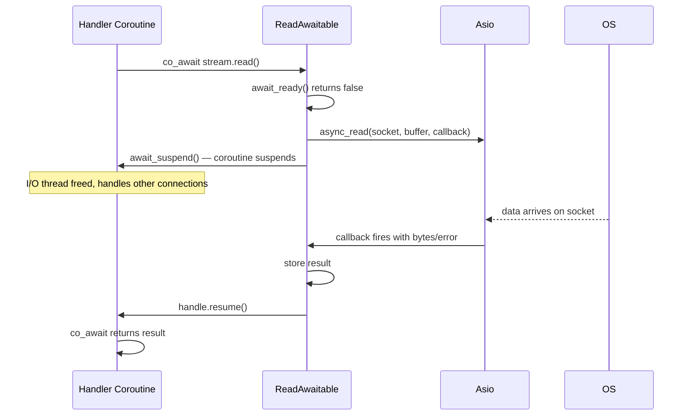

# Coroutines and Task<T>

## The Design Problem

Callback-based async code puts the programmer in charge of managing state across suspension points: every piece of data that must survive a callback boundary must be allocated somewhere explicitly, passed through the callback chain, and freed when the chain is done. This produces code that is difficult to read, difficult to reason about, and prone to dangling-reference bugs.

C++20 futures address some of these problems but introduce synchronization overhead and heap allocations for every `.then()` continuation. Neither approach reads like the synchronous code that most programmers find natural.

C++20 coroutines solve both problems. The compiler transforms a function with `co_await` into a state machine automatically, storing all live locals in a heap-allocated coroutine frame. The programmer writes code that looks synchronous; the compiler generates the async state machine.

## What a C++20 Coroutine Is

A coroutine is a function that can suspend and resume without occupying a dedicated OS thread. When a coroutine hits a `co_await` expression, it suspends — saving all its local variables into the coroutine frame — and returns control to the caller (typically the event loop). Later, when the awaited operation completes, the frame is resumed from the suspension point, and execution continues as if the `co_await` had returned synchronously.

The coroutine frame is heap-allocated by the compiler, typically 1 to 2 KB per coroutine for typical handler code. This means one million concurrent connections consume approximately 1 to 2 GB of memory for coroutine frames alone — a known trade-off (see Consequences below).

## Task<T> and the Promise Type

`aevox::Task<T>` is the coroutine return type used throughout Aevox. Every async handler, every `pool()` call, every `sleep()` call returns a `Task<T>`.

Under the hood, `Task<T>` has a `promise_type` that the compiler uses to control the coroutine lifecycle:

- `initial_suspend()` returns `std::suspend_always` — coroutines are **lazy**. They do not begin executing when created; they begin when `co_await`-ed by a caller.
- `final_suspend()` returns an awaitable that performs symmetric transfer back to the awaiting coroutine — no heap allocation or scheduling overhead at the return point.
- The result value (or `void`) is stored inside the promise object and retrieved by the awaiter.

A moved-from `Task<T>` holds a null coroutine handle. It must not be `co_await`-ed after being moved from — this is undefined behaviour.

## co_await Mechanics

The sequence for a single `co_await stream.read()`:

1. The compiler calls `ReadAwaitable::await_ready()` — returns `false` because data is not yet available.
2. The compiler calls `ReadAwaitable::await_suspend(handle)`. This posts an async read to Asio and returns the coroutine handle, suspending the coroutine.
3. The I/O thread is now free. It returns to the Asio event loop and can handle other coroutines.
4. The OS delivers data. Asio's callback fires.
5. The callback stores the result in `ReadAwaitable` and calls `handle.resume()`.
6. The coroutine resumes at the `co_await` expression. `await_resume()` returns the result (or error).

The `ReadAwaitable` and `WriteAwaitable` types live in `src/net/` — they are the only place in the codebase where Asio types appear. This is the enforcement of ADR-1 at the object level.

## Why Callbacks Are Banned

The `ConnectionHandler` concept enforces that every handler returns `aevox::Task<void>`. A lambda that returns `void` or a `std::future` does not satisfy the concept — the compiler rejects it at the call site.

Callbacks invert control flow: the programmer must manually track which data the callback closure needs and ensure that data outlives the callback. In a complex handler with several async steps, this produces deeply nested lambdas or explicit state machines. `co_await` eliminates this entirely — the compiler generates the state machine, and local variables are automatically preserved across suspension points.

This is captured by ADR-3: coroutines with `co_await` are the only async primitive in the public API.

## Thread Pinning (v0.1)

In v0.1, a coroutine is pinned to the I/O thread that accepted its connection (ADR-3). The coroutine never migrates between I/O threads during its lifetime.

When a coroutine calls `co_await aevox::pool(fn)`, the callable `fn` runs on a CPU thread. But when `fn` completes, the coroutine's continuation is posted back to the originating I/O thread — not to whichever CPU thread finished `fn`. This ensures that the coroutine's strand-safety properties are maintained without explicit locking.

Cross-thread migration (work-stealing across I/O threads for load balancing) is deferred to a future version.

## Consequences

- **Coroutine code reads like synchronous code** — lower cognitive load, easier to reason about, easier to debug. This is the primary motivating benefit.
- **Each coroutine frame is heap-allocated (~2 KB)** — 1M concurrent connections consume approximately 2 GB of frame memory. This is a known and accepted trade-off for the simplicity benefit.
- **No callback registration per I/O operation** — the `ReadAwaitable`/`WriteAwaitable` integration with Asio eliminates the per-operation allocation that a future-based model would require.
- **`Task<T>` is non-copyable and non-shareable** — ownership is explicit. A `Task<T>` must be `co_await`-ed exactly once. This prevents accidental double-resume bugs.

## See Also

- [Executor — Async I/O Abstraction](executor.md) — how the Executor spawns and resumes coroutines
- [Error Model](error-model.md) — how `std::expected` errors propagate through `co_await`
- [API Reference — Task](../api/task.md) — complete `Task<T>` reference
- [API Reference — Async Helpers](../api/async.md) — `pool()`, `sleep()`, `when_all()` implementations
- [User Guide — Async Patterns](../guide/async-patterns.md) — practical examples of every async pattern
