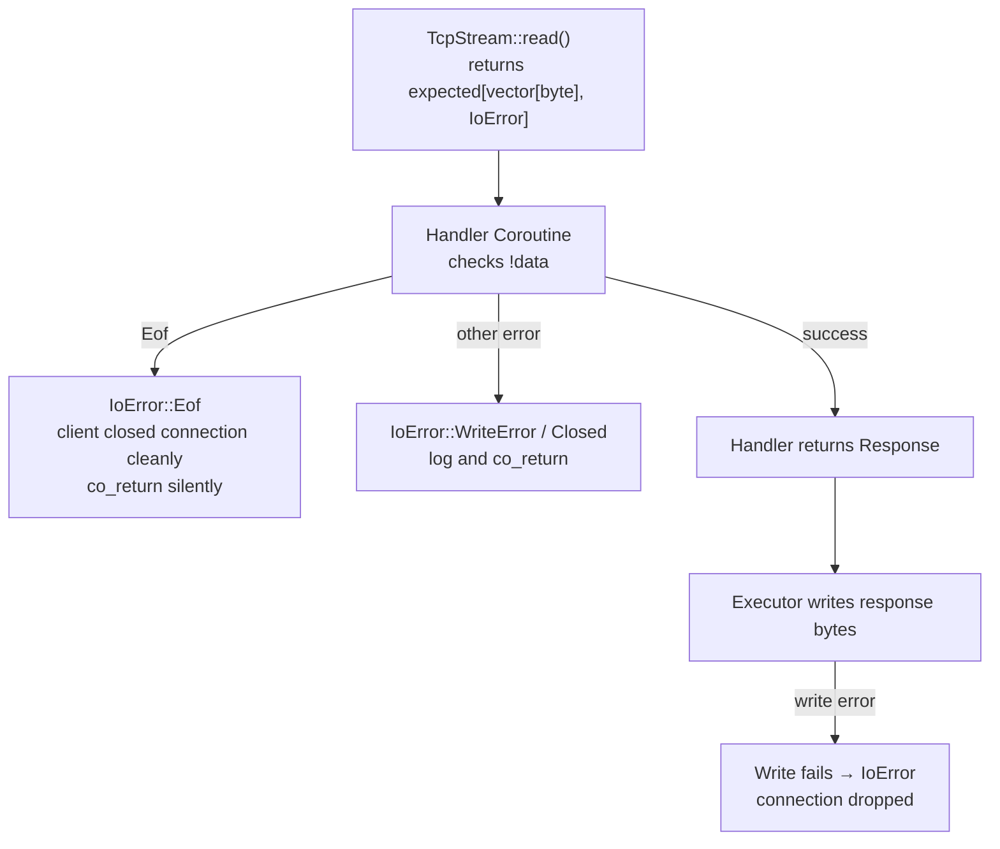

# Error Model

## The Design Problem

Exceptions for control flow make error paths invisible at the call site. When a function can throw, the caller has no indication in the function signature that an error is possible — only documentation (if it exists) reveals the failure modes. In a coroutine-based framework, exceptions also complicate the coroutine machinery: every `co_await` point becomes an implicit try/catch boundary, imposing overhead on the non-error path and making error-propagation logic harder to trace.

## std::expected as the Error Type

Every fallible Aevox operation returns `std::expected<T, E>`. The error type `E` is always a specific enum — never a string, never a generic error code. Every such return is marked `[[nodiscard]]`: the compiler emits a warning if the caller discards the result without checking it.

No Aevox function throws a recoverable error. The only exceptions that can propagate through Aevox code are:

- `std::bad_alloc` — a system-level unrecoverable condition
- Exceptions thrown by user-supplied lambdas passed to `aevox::pool()` — caught by the pool machinery and re-thrown at the `co_await` site

## Error Type Hierarchy



The error propagation chain starts at the lowest layer (`TcpStream::read()`) and flows upward through the handler coroutine to the response path. At each step, the handler must decide: is this a connection error (exit silently) or an application error (return an error response to the client)?

## Error Propagation in Coroutines

`co_await` unwraps a `Task<expected<T, E>>` into the outer `Task<T>` calling convention. The caller receives the `expected` directly and must check it. There is no automatic propagation (no `?` operator as in Rust). This is intentional: every error check is explicit and visible at the call site.

A two-level propagation example:

```cpp
// Helper function that can fail
aevox::Task<std::expected<std::string, aevox::IoError>>
read_line(aevox::TcpStream& stream) {
    auto data = co_await stream.read();
    if (!data) {
        co_return std::unexpected(data.error());
    }
    // Convert bytes to string and return
    co_return std::string{
        reinterpret_cast<const char*>(data->data()), data->size()};
}

// Caller must check the result
aevox::Task<void> handle(std::uint64_t, aevox::TcpStream stream) {
    auto line = co_await read_line(stream);
    if (!line) {
        // line.error() is IoError
        co_return;
    }
    // *line is the string
    co_await stream.write(/* response based on *line */);
}
```

The error flows from `read_line` to the caller without any magic. Both steps are visible and explicit.

## Exceptions from User Code

If a user-supplied lambda passed to `aevox::pool()` throws, the exception is caught by the CPU pool machinery and re-thrown at the `co_await aevox::pool(...)` call site in the coroutine. The caller can handle this with a try/catch:

```cpp
aevox::Task<void> handler(std::uint64_t, aevox::TcpStream stream) {
    try {
        auto result = co_await aevox::pool([]() {
            // This lambda can throw
            return possibly_throwing_computation();
        });
        co_await stream.write(/* result */);
    } catch (const std::exception& e) {
        // Handle the exception from the pool lambda
        co_return;
    }
}
```

Aevox itself never introduces this pattern — it is a consequence of user lambdas that `throw`. Prefer `std::expected` returns in pool lambdas to avoid the exception path entirely.

## Consequences

- **Error paths are visible at every call site** — there are no silent failures. The `[[nodiscard]]` annotation on `std::expected` returns makes it a compile error to ignore an error without an explicit discard.
- **`[[nodiscard]]` enforcement catches forgotten error checks at compile time** — a missed `if (!result)` check triggers a compiler warning. With `-Werror`, it is a compile error.
- **No unwinding overhead on the non-error path** — `std::expected` is a value type with no exception table entries and no stack unwinding. The non-error path is as fast as returning a plain value.
- **More verbose call sites compared to exception-based code** — every fallible call requires a check. This verbosity is intentional: error handling is a first-class concern, not an afterthought.

## See Also

- [Coroutines and Task<T>](coroutines.md) — how `co_await` interacts with `std::expected` returns
- [Executor — Async I/O Abstraction](executor.md) — `ExecutorError` propagation from `listen()` and `run()`
- [API Reference — Executor](../api/executor.md) — `ExecutorError` reference and `to_string()`
- [User Guide — Error Handling](../guide/error-handling.md) — practical error handling patterns
