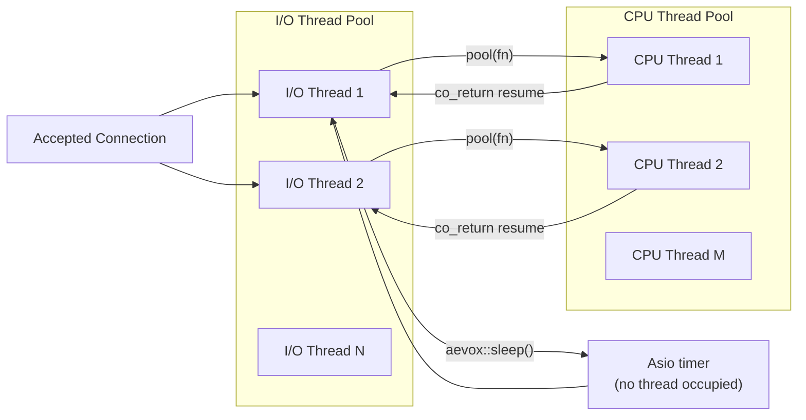

# Executor — Async I/O Abstraction

## The Design Problem

A web framework that couples itself directly to a specific async I/O library is permanently tied to that library. If application code ever calls `asio::io_context` directly, or if the framework's public headers expose Asio types, then every application that uses the framework must also depend on Asio. When a better async library becomes available — or when the C++ standard adds `std::net` — replacing the backend becomes a multi-year migration affecting every user.

## The Solution: Executor Interface

Aevox solves this by defining a single, narrow abstraction: `aevox::Executor`. This is the only networking type that appears in `include/aevox/`. Every Asio type — `io_context`, `thread_pool`, `awaitable`, `tcp::acceptor` — lives exclusively in `src/net/`. Application code and all higher-level Aevox code call through `aevox::Executor` and never touch Asio directly.

This is ADR-1: Asio is hidden behind `aevox::Executor`. This enables the `std::net` swap in C++29 with zero application-code changes.

The enforcement mechanism is the directory boundary: CI runs a header-include audit that fails if any file under `include/aevox/` contains an Asio include. The compiler also enforces this for users — they cannot include `asio.hpp` through any Aevox public header because no Aevox public header includes it.

## Thread Model

Two separate thread pools run inside `AsioExecutor`:

- **I/O Thread Pool** — accepts connections, dispatches coroutines, and handles all async I/O events. Sized to `hardware_concurrency()` by default.
- **CPU Thread Pool** — runs CPU-bound work submitted via `aevox::pool()`. Sized to 4 threads by default. This pool never runs I/O operations (ADR-2).

When a coroutine calls `co_await aevox::pool(fn)`, `fn` is posted to the CPU pool. The I/O thread that was running the coroutine is released immediately and can handle other connections. When `fn` completes, the coroutine's continuation is posted back to the I/O pool.

When a coroutine calls `co_await aevox::sleep(duration)`, an Asio timer is armed. No thread is blocked during the wait. When the timer fires, the coroutine is resumed on an I/O thread.

## The std::net Migration Path

Because the `Executor` interface is the sole networking boundary, replacing Asio with `std::net` (expected in C++29) requires changing only the files in `src/net/`:

- `src/net/asio_executor.hpp` / `src/net/asio_executor.cpp` — would become `src/net/stdnet_executor.hpp` / `.cpp`
- `src/net/asio_tcp_stream.hpp` / `src/net/asio_tcp_stream.cpp` — would become `src/net/stdnet_tcp_stream.hpp` / `.cpp`

Everything above the `Executor` boundary — `include/aevox/`, all application code, all higher-level framework modules — would require zero changes. The entire migration is a `src/net/` swap.

## Connection Lifecycle

Each accepted TCP connection goes through four phases:

1. **Accept** — the `AsioExecutor` accept loop calls `asio::ip::tcp::acceptor::async_accept()` and awaits an incoming connection.
2. **Spawn** — when a connection arrives, the executor constructs a `TcpStream` wrapping the socket and calls the registered handler coroutine with `(conn_id, stream)`.
3. **Handler runs** — the coroutine reads requests, dispatches to the router, writes responses, and loops until the client disconnects or an error occurs.
4. **Cleanup** — when the coroutine reaches `co_return`, `TcpStream`'s destructor calls the Asio socket's `close()`. The connection is gone.

Coroutines in v0.1 are pinned to the I/O thread that accepted their connection (ADR-3). They do not migrate between I/O threads.

## Consequences

- **Application code is always Asio-free** — users include `<aevox/executor.hpp>` and see only standard C++ types. This is the primary benefit: Aevox users do not need to know or care about Asio.
- **Backend swap is possible but the interface must be stable** — any new OS capability (e.g. `io_uring`-specific optimizations, UDP support) requires an addition to the `Executor` interface. The interface is a constraint as well as a benefit.
- **One layer of virtual dispatch at the boundary** — `aevox::Executor` uses virtual methods. This cost is paid once per connection lifecycle (at `listen()` and `run()`), not per I/O operation. Per-operation I/O goes through the coroutine machinery directly, not through a virtual call.

## See Also

- [Router — Path Matching](router.md) — how requests are dispatched after the Executor delivers them
- [Coroutines and Task<T>](coroutines.md) — how the coroutine machinery interacts with the Executor
- [Layer Diagram](layer-diagram.md) — where the Executor fits in the full stack
- [API Reference — Executor](../api/executor.md) — complete symbol reference
- [API Reference — TcpStream](../api/tcp_stream.md) — the stream type the Executor passes to each handler
