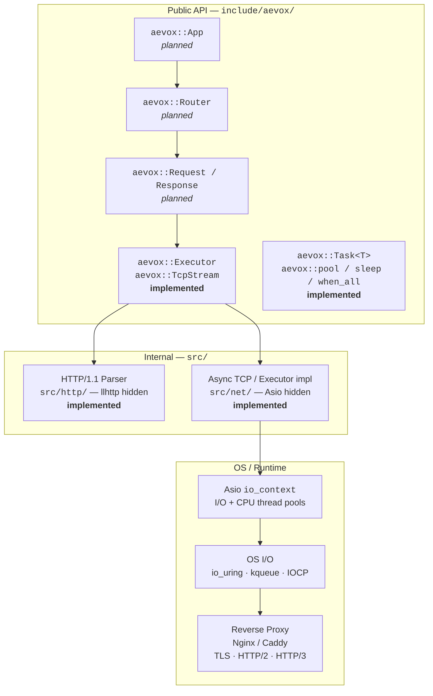
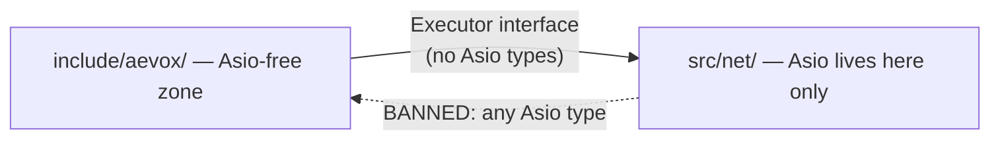
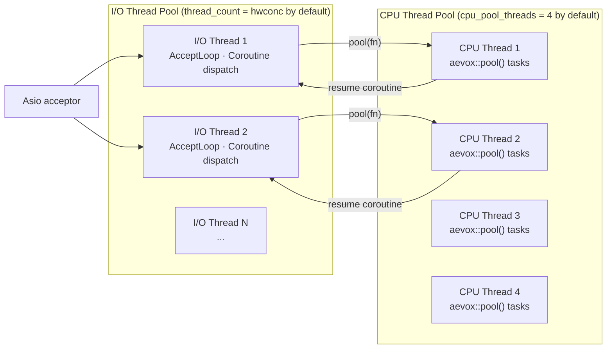
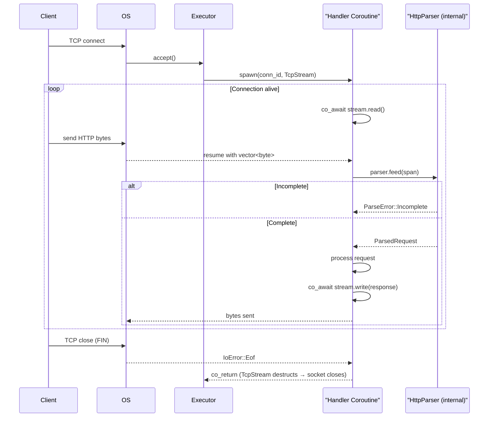
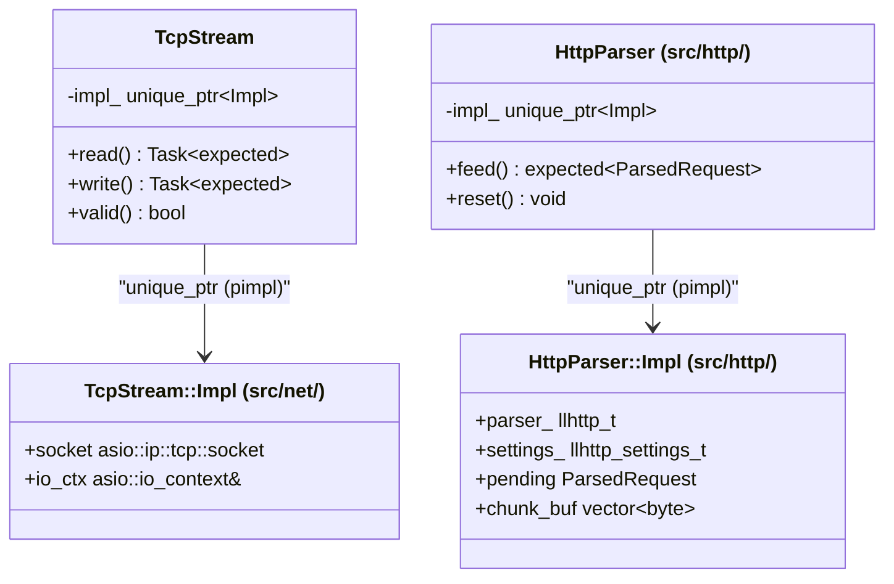
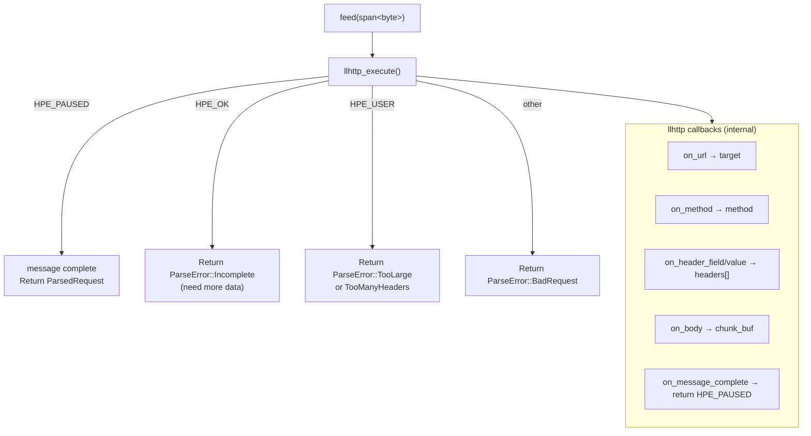

# Architecture Overview

Aevox is built as a strict layered system. Each layer depends only on the layer directly below it — no layer skips across boundaries, and no internal type leaks upward into the public API.

---

## Layer Diagram



---

## Key Design Invariants

### 1. Executor Firewall (ADR-1)

`aevox::Executor` in `include/aevox/executor.hpp` is the **only networking abstraction** visible to application code. No Asio type (`asio::io_context`, `asio::awaitable`, `asio::thread_pool`) ever appears above this boundary.



**Why:** When `std::net` standardises in C++29, replacing Asio requires changes only in `src/net/`. Zero application-code changes.

### 2. No Third-Party Types in Public Headers (ADR-1)

`include/aevox/` may only include C++ standard library headers. llhttp, glaze, spdlog, fmtlib, and Asio are all implementation details of `src/`.

### 3. Errors as Values (PRD §6.4)

`std::expected<T, E>` is the error model everywhere. Exceptions are never used for control flow — they only propagate from third-party code through coroutine machinery.

### 4. Async as Coroutines (ADR-3)

`aevox::Task<T>` is the only async primitive exposed publicly. No callbacks appear in the public API. The handler signature `Task<void>(uint64_t, TcpStream)` is enforced by the `ConnectionHandler` concept.

---

## Thread Model



**Rules:**

- All coroutines run on I/O threads by default (ADR-3: pinned to originating thread in v0.1).
- `aevox::pool()` moves CPU-bound work to the CPU pool, suspending the coroutine. When done, the coroutine resumes on an I/O thread.
- `aevox::sleep()` suspends via an Asio timer — no thread is occupied during the wait.
- Thread-local bridges (`tl_post_to_io`, `tl_post_to_cpu`, `tl_schedule_after`) are set on each I/O thread by `AsioExecutor` and used by `pool()`, `sleep()`, and `when_all()`.

---

## Request Flow (Current — Raw TCP)



---

## Pimpl Pattern

Both `TcpStream` and `HttpParser` (internal) use pimpl (`std::unique_ptr<Impl>`) to hide their concrete types:



---

## HTTP Parser Layer

`aevox::detail::HttpParser` in `src/http/` wraps llhttp with an incremental feed model:



**Constraints enforced by `ParserConfig`:**

| Config field | Default | Protection |
|---|---|---|
| `max_header_count` | 100 | Hash-flood / DoS on header map |
| `max_body_bytes` | 1 MiB | Memory exhaustion on large uploads |

**Zero-copy note:** `ParsedRequest::method`, `target`, and `headers` are `string_view` / `span` into the caller's buffer. The caller must keep the buffer alive while using the result.

---

## File Structure

```
aevox/
├── include/aevox/          # PUBLIC API — no Asio, no third-party types
│   ├── executor.hpp        # Executor, ExecutorConfig, ExecutorError, ConnectionHandler
│   ├── task.hpp            # Task<T>, Task<void>
│   ├── async.hpp           # pool(), sleep(), when_all()
│   └── tcp_stream.hpp      # TcpStream, IoError
│
├── src/
│   ├── net/                # ALL Asio code lives here only
│   │   ├── asio_executor.hpp/.cpp      # AsioExecutor implements Executor
│   │   └── asio_tcp_stream.hpp/.cpp    # TcpStream::Impl + ReadAwaitable/WriteAwaitable
│   └── http/               # HTTP parsing — llhttp confined here
│       ├── http_parser.hpp             # HttpParser, ParsedRequest, ParseError (internal)
│       └── http_parser.cpp             # llhttp callbacks and feed() logic
│
└── tests/
    ├── unit/
    │   ├── net/    # AEV-001, AEV-006 unit tests
    │   └── http/   # AEV-003 HTTP parser unit tests
    └── integration/
        ├── net/    # AEV-001, AEV-006 integration tests (real loopback)
        └── http/   # AEV-003 integration tests (real loopback + parser)
```

---

## Architecture Design Documents

ADDs live in `Tasks/architecture/`. Each ADD covers one task's design in full — open issues, file maps, API sketches, and deviation records.

| ADD | Task | Status |
|---|---|---|
| `Tasks/architecture/AEV-001-arch.md` | Asio-backed executor, `Task<T>`, TCP accept loop | Done |
| `Tasks/architecture/AEV-003-arch.md` | `TcpStream`, HTTP/1.1 parser (llhttp), `ConnectionHandler` breaking change | Done |
| `Tasks/architecture/AEV-006-arch.md` | CPU thread pool, `pool()`, `sleep()`, `when_all()` | Done |

---

## ADR Summary

| ADR | Decision |
|---|---|
| ADR-1 | Asio hidden behind `aevox::Executor`. Enables `std::net` swap in C++29 with zero app changes. |
| ADR-2 | `aevox::pool()` uses a separate CPU thread pool — never the I/O pool, to prevent starvation. |
| ADR-3 | Coroutines are pinned to their originating I/O thread in v0.1. Cross-thread migration deferred. |
| ADR-4 | Regex routing is opt-in, not available in v0.1. |
| ADR-5 | C++20 modules are opt-in in v0.4. |
| ADR-6 | HTTP/2 is permanently out of scope — delegated to Nginx/Caddy. |
