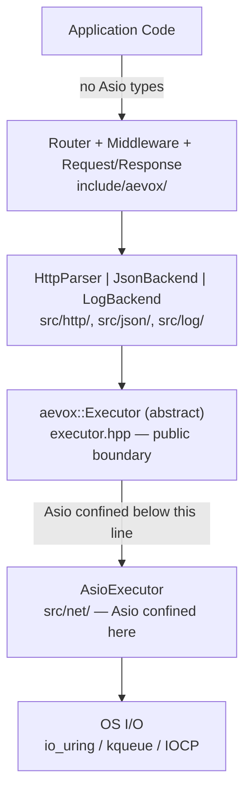

# Layer Diagram

## The Canonical Layers

Aevox is organized as a strict set of layers. Each layer depends only on the layer directly below it. No layer skips across boundaries, and no internal type leaks upward into the public API.



The arrows show allowed dependency direction. Data flows downward; nothing flows upward. A lower layer never calls into a higher layer.

## What Each Boundary Enforces

### Application Code / Public API Boundary

Users `#include <aevox/...>` only. They never include files from `src/`, never include Asio headers, and never include llhttp. Their code compiles without any knowledge that Asio or llhttp exist.

This boundary is enforced by the compiler: Asio headers are not on the include path for user code. Even if a user tried to include `asio.hpp` directly, they would need to add Asio to their own build separately.

### Public API / Internal Implementation Boundary

All files under `include/aevox/` may only include C++ standard library headers and other `include/aevox/` headers. Third-party types — Asio, llhttp, glaze, spdlog, fmtlib — are forbidden in `include/aevox/`.

This is enforced by CI: a header-include audit script scans every file under `include/aevox/` and fails the build if any non-standard include is found. It is also enforced by code review.

### Internal / Executor Interface Boundary

`src/http/`, `src/json/`, and `src/log/` perform any async I/O through the `Executor` interface — specifically through `aevox::TcpStream`, `aevox::pool()`, and `aevox::sleep()`. These modules do not include Asio headers. They depend on `include/aevox/executor.hpp` only.

This boundary is the `executor.hpp` firewall. It ensures that the HTTP parser, JSON backend, and log backend remain portable. They work with any `Executor` implementation.

### Executor Interface / Asio Implementation Boundary

This boundary is ADR-1. Everything above this line is Asio-free. The `AsioExecutor` class in `src/net/` is the only Asio-aware code in the repository. `TcpStream::Impl` and the awaitable types (`ReadAwaitable`, `WriteAwaitable`) also live here.

Replacing Asio with `std::net` (expected in C++29) touches only `src/net/`. The files above this boundary — `include/aevox/`, `src/http/`, `src/json/`, `src/log/`, and all application code — require zero changes.

## Why Layers Must Not Be Violated

A concrete example: suppose a route handler directly used `asio::steady_timer` instead of `aevox::sleep()`:

```cpp
// DO NOT DO THIS — layer violation
#include <asio/steady_timer.hpp>

app.get("/delayed", [](aevox::Request&) -> aevox::Task<aevox::Response> {
    asio::steady_timer timer(/* io_context obtained somehow */);
    timer.expires_after(std::chrono::milliseconds{100});
    co_await timer.async_wait(asio::use_awaitable);
    co_return aevox::Response::ok("delayed");
});
```

This handler breaks the layer invariant in two ways:

1. It includes an Asio header in application code.
2. It depends on the concrete Asio `io_context` — which does not exist in a `std::net` implementation.

When `src/net/` is swapped for a `std::net` backend, this handler would fail to compile. The entire benefit of ADR-1 is destroyed by one handler.

The correct code uses `aevox::sleep()`:

```cpp
#include <aevox/async.hpp>
#include <chrono>

app.get("/delayed", [](aevox::Request&) -> aevox::Task<aevox::Response> {
    co_await aevox::sleep(std::chrono::milliseconds{100});
    co_return aevox::Response::ok("delayed");
});
```

This is Asio-free, portable to any `Executor` backend, and correct.

## Consequences

- **Strict layering constrains where new code can go** — every new file must be placed in the correct layer. A new feature that requires async I/O goes in `src/`, not in `include/aevox/`. This is a constraint, but it is also a clarifying constraint: the layer tells you exactly where a piece of code belongs.
- **Pimpl pattern in `TcpStream` and `HttpParser` is the mechanical enforcement** — both types use `std::unique_ptr<Impl>` to hide their concrete types. The `Impl` is defined in `src/net/` and `src/http/` respectively. Application code and public headers see only the `TcpStream` and `HttpParser` class declarations — never the fields inside their `Impl`.
- **The layer diagram is an invariant, not a suggestion** — it is replicated in the project rules as a CI-enforced constraint. Any change to the diagram requires updating both this document and the project rules. Violations are code review rejections.

## See Also

- [Executor — Async I/O Abstraction](executor.md) — the design of the `Executor` boundary in detail
- [Router — Path Matching](router.md) — where the router sits in the stack
- [Coroutines and Task<T>](coroutines.md) — how coroutines cross layer boundaries
- [Error Model](error-model.md) — how errors propagate through the layers
- [API Reference — Executor](../api/executor.md) — the public surface of the Executor layer
