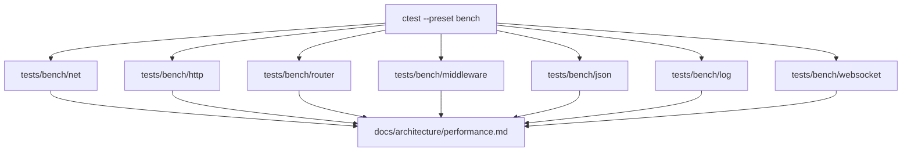

# Performance

Aevox keeps performance work repeatable by treating benchmarks as release-build test targets. The
suite uses nanobench for hot-path measurements, CTest labels for predictable execution, and small
markdown baseline notes instead of large raw logs.

## Design Rationale

The PRD sets headline targets for HTTP/1.1 throughput, WebSocket message throughput, coroutine
scale, latency, startup time, compile time, and binary size. A shared laptop or CI runner cannot
enforce all of those as hard gates without becoming noisy, so the benchmark suite has two jobs:

- Prove the benchmark programs build and run through the normal CMake/CTest workflow.
- Produce local baseline numbers that optimization PRs can compare before and after a change.

The benchmark executables live under `tests/bench/` and link `nanobench::nanobench`. Benchmark-only
dependencies stay in tests. Public headers under `include/aevox/` remain free of nanobench, Asio,
llhttp, glaze, fmtlib, and Catch2 types.

## Invariants / Guarantees

| Invariant | Enforcement |
|---|---|
| Benchmarks run from a release build | Use `cmake --preset release` and `ctest --preset bench` |
| Every benchmark is discoverable | Each executable is registered with CTest label `bench` |
| Public API stays benchmark-free | Benchmark helpers live under `tests/support/` |
| Networking benchmarks use real loopback I/O | HTTP and executor benchmarks use standalone Asio clients in `tests/bench/` |
| Headline throughput is not a CI hard gate | Results are reported as baselines unless a controlled runner exists |

## Diagrams



## Running The Suite

Use a release build for useful numbers:

```bash
cmake --preset release
cmake --build --preset release --target aevox_tests_bench
ctest --preset bench
```

For the helper unit tests:

```bash
ctest --preset release -R "Benchmark stats" --output-on-failure
```

## Benchmark Map

| Executable | Area measured | PRD metric informed |
|---|---|---|
| `accept-throughput` | TCP accept loop on loopback | HTTP/1.1 throughput capacity |
| `executor-throughput` | Handler dispatch and `pool()` round-trip | Thread pool task latency |
| `http-keepalive-throughput` | Real `App` keep-alive request/response loop | HTTP/1.1 requests/sec and request latency |
| `router-dispatch-throughput` | Static, typed-parameter, and wildcard route dispatch | Router hot-path overhead |
| `pipeline-throughput` | Zero, one, and ten middleware dispatch paths | Middleware overhead |
| `json-serialization-throughput` | Small and medium DTO serialize/deserialize paths | JSON body overhead |
| `logger-hot-path` | Disabled, enqueue/write, and saturated logging paths | Request-path logging overhead |
| `websocket-throughput` | Frame parse and topic-bus publish/fanout | WebSocket messages/sec |

## Current Baseline

Representative output should stay small. Record the date, machine class, compiler, and a few headline
numbers. Do not commit full nanobench logs.

| Date | Environment | Benchmark | Representative result |
|---|---|---|---|
| 2026-05-22 | Local release build, GCC 15.2 | `http-keepalive-throughput` | ~38,828 responses/sec; 0 failed responses; p50 20,176 ns; p99 30,048 ns; p999 74,899 ns |
| 2026-05-22 | Local release build, GCC 15.2 | `router-dispatch-throughput` | Static ~7.44M dispatch/s; typed ~5.04M dispatch/s; wildcard ~4.98M dispatch/s; p99 119 ns |

Future optimization PRs should include before/after benchmark output in the PR description. CI should
verify benchmark executables build and run; controlled performance hardware can add hard thresholds
later.

## Trade-offs

The HTTP benchmark uses real loopback I/O through `aevox::App`, so it measures more of the product
path than an isolated parser benchmark. That also makes it more sensitive to host scheduling, kernel
state, and CPU power settings. For that reason, HTTP requests/sec and p99/p999 latency are reported
baselines.

The router benchmark is in-process and synthetic. It isolates path matching, parameter extraction,
handler erasure, and coroutine dispatch without network noise. It does not claim end-to-end HTTP
throughput.

Startup time, hello-world compile time, and static binary size are deferred to release engineering
because accurate measurement requires install/package artifacts rather than per-test executables.

## Related ADRs

| ADR | Relevance |
|---|---|
| ADR-1 | Asio remains hidden behind `aevox::Executor`; benchmark clients may use Asio only in `tests/bench/` |
| ADR-3 | Coroutine dispatch measurements assume v0.1 pinned coroutine execution |

## See Also

- [Executor](executor.md) - I/O abstraction and thread model
- [Router](router.md) - route matching and handler dispatch
- [Layer Diagram](layer-diagram.md) - dependency boundaries enforced by the project
