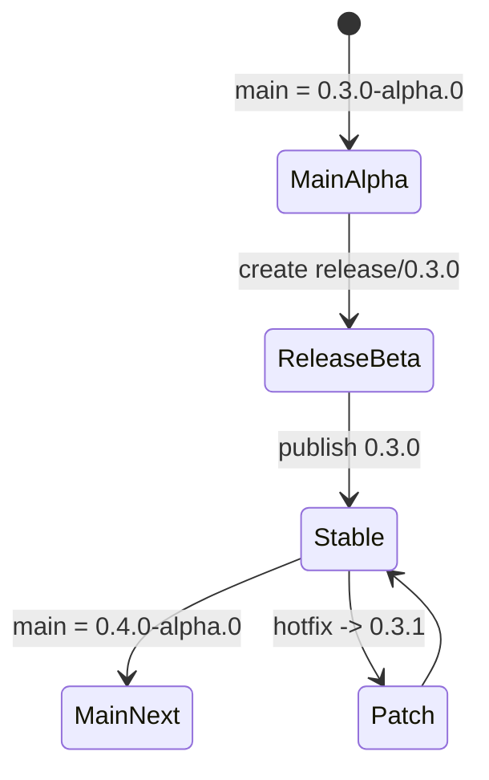

# Release Architecture

Aevox release engineering is designed around long-lived release branches and standard CMake package
installation. This keeps supported release lines visible and lets consumers install Aevox without
building tests or examples.

## Branch-Based Releases

Tags are immutable markers for published releases, but they are not enough to maintain a release
line. The `release/X.Y.Z` branch is the source for:

- beta validation builds
- stable `X.Y.Z` publication
- patch releases such as `X.Y.1`
- hotfix cherry-picks back to `main`



## Build Boundary

The default CMake build configures only the Aevox library. Tests, benchmarks, and examples are
explicit opt-ins used by developers and CI:

| Mode | Purpose |
|---|---|
| default | Build the library only |
| test presets | Build and run tests and examples |
| bench preset | Build benchmarks explicitly |
| install validation | Install library and build an external consumer |

This boundary keeps dependency consumers from paying for project validation targets.

## Installation Validation

The CI workflow installs Aevox into a staging prefix, then configures a separate project with:

```cmake
find_package(aevox REQUIRED)
target_link_libraries(aevox_install_consumer PRIVATE aevox::aevox_core)
```

That consumer is built and run on Linux and Windows. The release workflow repeats the same
validation before archiving artifacts or publishing a GitHub Release.
