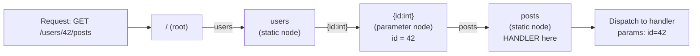

# Router — Path Matching

## The Design Problem

HTTP routing must scale to thousands of registered routes without slowing down at high request rates. A naive linear scan through a list of patterns is O(N) per request — at 1,000 routes and 1,000,000 requests per second that is 10^9 comparisons per second just for routing. This is unacceptable. The routing algorithm must be O(path-segment-depth), not O(route-count).

## Trie-Based Matching

Aevox stores routes in a trie (prefix tree) where each node represents one URL path segment. Looking up a route traverses the trie from the root, consuming one segment per level. The time complexity is O(D) where D is the number of segments in the path — completely independent of how many routes are registered.

Each trie node has three child types:

- **Static children** — an exact string match (e.g. `users`, `health`)
- **Named-parameter child** — captures any non-empty segment into a named slot (e.g. `{id}`, `{id:int}`)
- **Wildcard child** — captures all remaining segments (e.g. `{path...}`)

The router consumes each segment of `/users/42/posts` in order:

1. `users` — exact static match at depth 1
2. `42` — matched by the `{id:int}` parameter node at depth 2; `42` is converted to `int` and stored as `id`
3. `posts` — exact static match at depth 3

The handler registered at that node is then dispatched with the extracted parameters.

## Match Priority

At each trie node, children are tested in this order:

1. Static children first — the exact string is tried
2. Named-parameter child second — any non-empty segment matches
3. Wildcard child last — matches everything remaining

This priority rule means route registration order is irrelevant. Two routes registered in any order will always produce deterministic, unambiguous matches.

For example: if both `/users/me` and `/users/{id}` are registered, a request to `/users/me` always matches the static route because static children are tested before parameter children.

## Parameter Extraction

Typed parameters (`{id:int}`, `{factor:float}`, etc.) are converted using `std::from_chars` — no locale, no allocations, no exceptions. If the segment cannot be fully parsed as the requested type, routing returns `RouteError::BadParam`, which becomes a 400 Bad Request response without calling the handler.

`std::string_view` parameters are zero-copy views into the request target buffer. The buffer is owned by the `Request` object. The lifetime requirement is: the parameter views remain valid for the lifetime of the `Request`, which is for the duration of the handler invocation. Do not store `std::string_view` parameters past the handler return — copy to `std::string` if ownership is required.

## Handler Type Erasure

Route handlers are stored using `std::move_only_function`. This allows lambdas with move-only captures (e.g. a `std::unique_ptr`) to be used as handlers without wrapping.

Each registration arity (0 extracted parameters, 1 parameter, 2 parameters) is wrapped in a type-erased dispatcher at registration time. The dispatcher converts the arity-N signature into the uniform internal dispatch interface. At dispatch time, the call goes through `std::move_only_function` — one indirect call, no virtual dispatch.

## Consequences

- **O(depth) matching is fast even with thousands of routes** — adding more routes does not slow down dispatch for any existing route.
- **Trie nodes are allocated at registration time (cold path)** — during `app.get(...)`, the router builds trie nodes. At dispatch time (hot path), the trie is traversed read-only with no allocation.
- **Regex routing is deferred to opt-in** (ADR-4) — regex matching would add per-segment overhead for every request, even for routes that do not use regex. The common case is served by the trie; regex is planned as an opt-in extension.
- **Handler ownership is move-only** — lambdas with move-only captures are supported. This is a strict improvement over `std::function` which requires `CopyConstructible` captures.

## See Also

- [Layer Diagram](layer-diagram.md) — where the router sits in the full Aevox stack
- [Error Model](error-model.md) — how `RouteError` propagates to HTTP responses
- [API Reference — Router and App](../api/router.md) — complete reference for route patterns, methods, groups
- [User Guide — Routing](../guide/routing.md) — practical examples for all routing features
