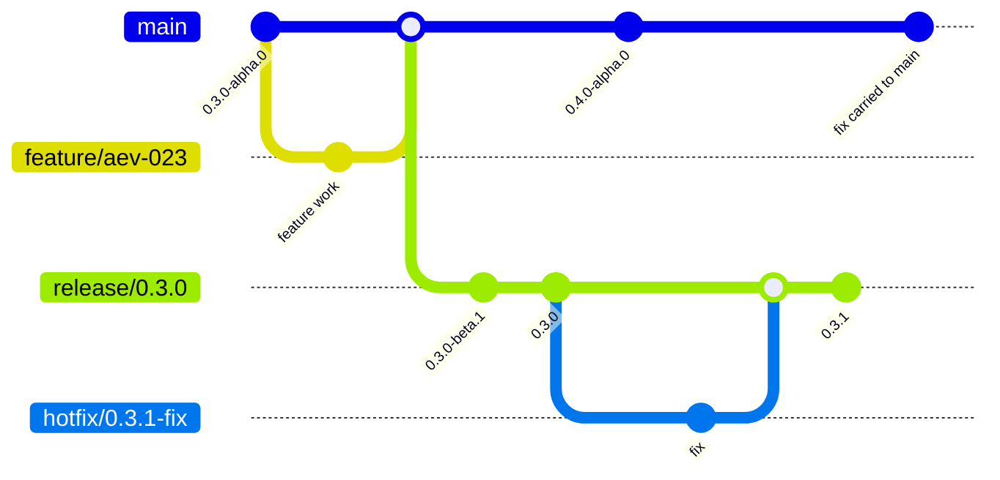

# Contributing

Aevox uses short-lived feature branches, protected CI on `main`, and explicit release branches for
published versions. Release branches are required: tags mark published points, but tags alone do not
create a supported release line.

## Branches

| Branch | Purpose | Example |
|---|---|---|
| `main` | Next minor development line | `0.3.0-alpha.0` |
| `feature/<slug>` | One focused task or fix | `feature/aev-023-release-branching` |
| `release/X.Y.Z` | Stabilization and patch line for a concrete release | `release/0.3.0` |
| `hotfix/X.Y.Z-<slug>` | Emergency patch work from a release branch | `hotfix/0.3.1-router-fix` |

Feature work starts from `main` and returns through pull requests. Release branches are created
manually when a version is feature-complete and only stabilization remains. Do not add new features
directly to `release/X.Y.Z`.

## Git Workflow

## Release And Branching

The release process is branch-based:

1. Develop on `main`.
2. Create `release/X.Y.Z` from the selected `main` commit.
3. Stabilize on the release branch with beta builds.
4. Publish stable `X.Y.Z` from the release branch.
5. Move `main` to the next minor alpha line.
6. Produce patch releases such as `X.Y.1` and `X.Y.2` from the release line.

Bug fixes should land on `main` first when practical, then be cherry-picked to the active release
branch. Emergency fixes may start from a `hotfix/X.Y.Z-<slug>` branch and must be carried back to
`main`.

See [Release Versioning](contributing/release-versioning.md) for the full version format and
[Installation](guide/installation.md) for installing Aevox from source or release artifacts.
