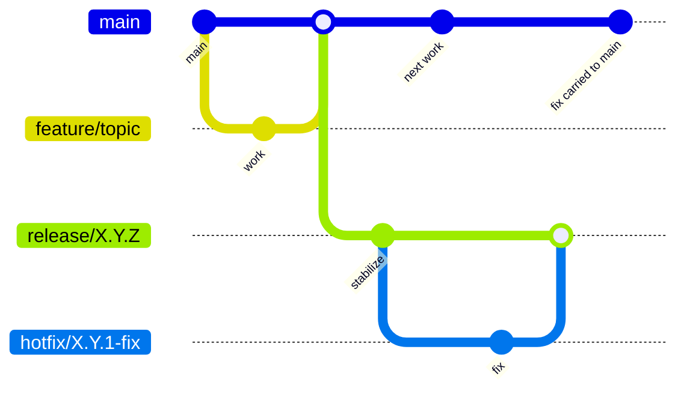

# Contributing

Aevox uses focused issues, short-lived feature branches, pull-request review, and protected CI. This
page explains the everyday contribution workflow. Detailed release numbering is kept in
[Release Versioning](contributing/release-versioning.md).

## Before You Start

Read the relevant guide or API page before changing behavior. For larger changes, check the task and
architecture documents linked from the issue or pull request. Aevox is intentionally strict about
layer boundaries and C++ style because small leaks in the public surface are expensive to undo later.

Use a focused branch for one task:

```bash
git switch main
git pull --ff-only
git switch -c feature/<short-topic>
```

## Creating Issues

Open an issue before starting work unless the change is a small typo or an obvious documentation
correction. A useful issue should include:

| Issue type | Include |
|---|---|
| Bug | Current behavior, expected behavior, minimal reproduction, compiler/OS, relevant logs |
| Feature | User problem, proposed behavior, affected API or docs, compatibility concerns |
| Performance | Workload, benchmark command, before/after numbers if available, hardware/compiler details |
| Documentation | Page or section, what is missing or incorrect, suggested reader outcome |

Keep issues scoped. Separate unrelated bugs or features into separate issues so review and rollback
stay simple.

## Pull Requests

Every pull request should do one thing well. Before opening a PR:

1. Rebase or merge the latest `main`.
2. Run formatting and relevant tests locally.
3. Update docs and changelog entries when behavior, build commands, public API, or user workflow
   changes.
4. Describe what changed, why it changed, how it was verified, and whether there are breaking
   changes.

PRs that touch architecture-sensitive areas need design sign-off before implementation. That includes
public headers, executor behavior, networking internals, dependency changes, release workflow, and
anything that affects the no-public-Asio boundary.

## Branches

| Branch | Purpose | Example |
|---|---|---|
| `main` | Current development line | `main` |
| `feature/<slug>` | One focused task or fix | `feature/router-validation` |
| `release/X.Y.Z` | Stabilization and patch line for one concrete release | `release/0.3.0` |
| `hotfix/X.Y.Z-<slug>` | Emergency patch work from a release branch | `hotfix/0.3.1-router-fix` |

Feature work starts from `main` and returns through pull requests. Release branches are created by
maintainers when a version is feature-complete and only stabilization remains. Do not add new
features directly to a release branch.

## Git Workflow



## Coding Rules

Aevox code is C++23 and must keep the public API independent from implementation libraries.

| Area | Rule |
|---|---|
| Public headers | No Asio, llhttp, glaze, fmtlib, or other third-party types in `include/aevox/` |
| Errors | Use `std::expected` for fallible operations and check returned values |
| Ownership | Use `std::make_unique` or `std::make_shared`; do not use raw owning `new` or `delete` |
| Nullable values | Use `std::optional`, not nullable raw pointers |
| Buffers | Use `std::span`, not pointer-length parameter pairs |
| Strings | Use `std::string_view` for non-owning string parameters |
| Formatting | Use `std::format`, not `printf`, `sprintf`, or ad hoc string concatenation |
| Public docs | Public symbols in `include/aevox/` require Doxygen comments |
| Tests | Add focused Catch2 tests for behavior changes and run the relevant presets |

See [Coding And Formatting](contributing/coding-formatting.md) for the detailed formatting and style
reference.

## Local Checks

Run the checks that match your change before asking for review:

```bash
bash scripts/format.sh
cmake --preset default-tests
cmake --build --preset default-tests
ctest --preset default-tests --output-on-failure
bash scripts/tidy.sh
mkdocs build --strict
```

For narrow documentation-only edits, `mkdocs build --strict` is usually enough. For C++ changes, run
formatting, build, tests, and tidy.

## Releases

Release mechanics are maintained separately from day-to-day contribution rules:

- [Release Versioning](contributing/release-versioning.md) explains alpha, beta, stable, and patch
  version formats.
- [Release Architecture](architecture/release.md) explains the CI and artifact flow.
- [Installation](guide/installation.md) explains how users install the library.
