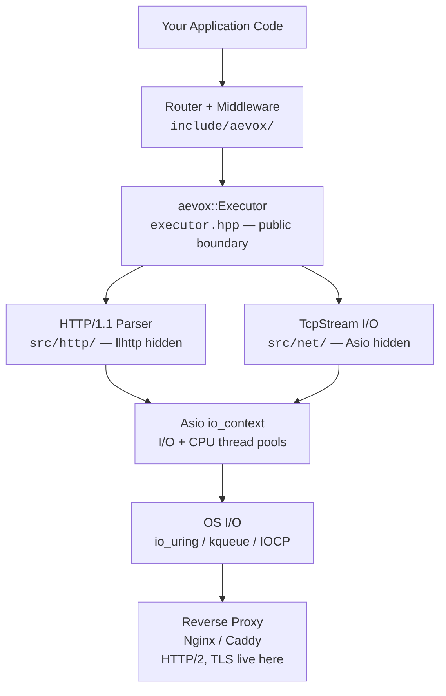

# Aevox

**A modern C++23 web framework** built for developers who need to handle millions of concurrent connections without sacrificing code clarity.

## v0.1 Alpha

The complete v0.1 stack is available. Write a working HTTP server in five lines:

```cpp
#include <aevox/app.hpp>

int main() {
    aevox::App app;
    app.get("/hello", [](aevox::Request&) {
        return aevox::Response::ok("Hello, World!");
    });
    app.listen(8080);
}
```

See the [Hello World example](examples/hello-world.md) for a full walkthrough.

---

## Architecture at a Glance



---

## Core Philosophy

**Zero-cost abstractions** — you pay only for what you use. Abstractions compile away; no overhead is introduced for features you do not call.

**Performance by design** — every decision optimises for both memory and CPU efficiency. O(depth) routing, coroutine frames under 2 KB, no per-request allocation on the hot path.

**Designed for C++ developers** — a five-line API gets a server running. `co_await` reads like synchronous code. Errors are explicit values, not surprises.

**Modern C++ throughout** — `std::expected<T, E>` for errors, `co_await` for async, concepts for constraints, `std::string_view` and `std::span` for zero-copy — no legacy patterns anywhere.

**Clean layered architecture** — networking, parsing, and routing are separate layers with enforced boundaries. Swapping the async backend (Asio → `std::net` in C++29) touches one directory and nothing else.

---

## What Is Built Today

| Component | Status | Header |
|---|---|---|
| Async I/O executor | **Done** | `<aevox/executor.hpp>` |
| Coroutine task type | **Done** | `<aevox/task.hpp>` |
| CPU offload + timers + fan-out | **Done** | `<aevox/async.hpp>` |
| Async TCP stream | **Done** | `<aevox/tcp_stream.hpp>` |
| HTTP/1.1 parser | **Done** | internal (`src/http/`) |
| Router + path matching | **Done** | `<aevox/router.hpp>` |
| Request / Response model | **Done** | `<aevox/request.hpp>` |
| App high-level API | **Done** | `<aevox/app.hpp>` |

---

## What Aevox Is NOT

- Not an HTTP/2 or HTTP/3 server — delegate to Nginx or Caddy for protocol termination
- Not an ORM or database framework
- Not a TLS certificate manager — place TLS in your reverse proxy

---

## See Also

- [Getting Started](getting-started.md) — zero to a running TCP echo server in minutes
- [User Guide](guide/index.md) — step-by-step guide to every framework feature
- [API Reference](api/index.md) — complete symbol reference for all public headers
- [Architecture Overview](architecture/index.md) — design rationale and layer diagram
