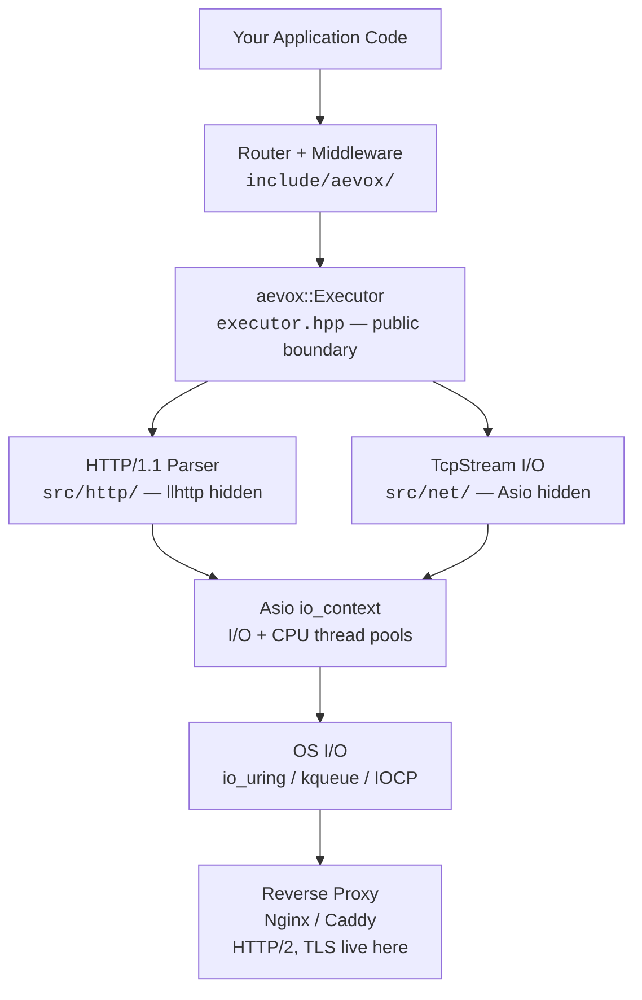

# Aevox

**A modern C++23 web framework** built for developers who need to handle millions of concurrent connections without sacrificing code clarity.

## Current State (v0.1-pre)

The low-level networking stack is complete. You can write raw TCP servers today using coroutines:

```cpp
#include <aevox/executor.hpp>
#include <aevox/tcp_stream.hpp>
#include <print>

int main() {
    auto ex = aevox::make_executor();

    ex->listen(8080, [](std::uint64_t conn_id, aevox::TcpStream stream) -> aevox::Task<void> {
        for (;;) {
            auto data = co_await stream.read();
            if (!data) co_return;           // EOF or error
            co_await stream.write(*data);   // echo back
        }
    });

    ex->run();
}
```

The HTTP/1.1 layer, router, and high-level `App` API are in active development. The final API will look like:

```cpp
// Coming in v0.1 — not yet available
aevox::App app;
app.get("/hello", [](aevox::Request& req) {
    return aevox::Response::ok("Hello, World!");
});
app.listen(8080);
```

---

## Architecture at a Glance



---

## Core Philosophy

**Zero-cost abstractions** — you pay only for what you use. No virtual dispatch in hot paths beyond the `Executor` boundary.

**Errors as values** — `std::expected<T, E>` throughout. No exceptions for control flow, no surprise throws in handlers.

**Async as coroutines** — `co_await` feels like synchronous code. No callbacks, no futures, no manual state machines.

**Strict layering** — Asio and llhttp are implementation details of `src/`. They never appear in `include/aevox/`. When `std::net` standardises (C++29), the backend swaps with zero application-code changes.

---

## What Is Built Today

| Component | Status | Header |
|---|---|---|
| Async I/O executor | **Done** | `<aevox/executor.hpp>` |
| Coroutine task type | **Done** | `<aevox/task.hpp>` |
| CPU offload + timers + fan-out | **Done** | `<aevox/async.hpp>` |
| Async TCP stream | **Done** | `<aevox/tcp_stream.hpp>` |
| HTTP/1.1 parser | **Done** | internal (`src/http/`) |
| Router + path matching | In progress | `<aevox/router.hpp>` |
| Request / Response model | In progress | `<aevox/request.hpp>` |
| App high-level API | Planned | `<aevox/app.hpp>` |

---

## What Aevox Is NOT

- Not an HTTP/2 or HTTP/3 server — delegate to Nginx or Caddy for protocol termination
- Not an ORM or database framework
- Not a TLS certificate manager — place TLS in your reverse proxy
